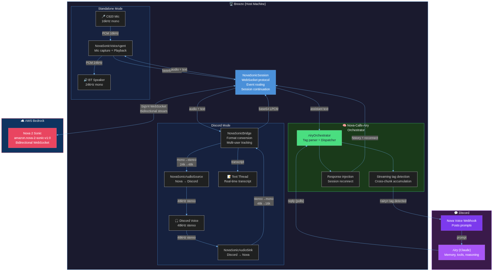

# Nova Sonic Voice

We gave a voice model a brain. Nova 2 Sonic handles the voice, Claude handles the cognition. Real-time voice conversations where the models call each other.

Built for the [Amazon Nova AI Hackathon](https://amazon-nova.devpost.com/) targeting **Best Voice AI** (deadline March 16, 2026).

## What it does

Nova Sonic Voice is a real-time voice conversation system where Amazon Nova 2 Sonic acts as the conversational front end and actively calls into a Claude backend when it needs deeper cognition. Nova handles speech, turn detection, and natural conversation flow. When a question requires memory, web search, or reasoning beyond casual chat, Nova emits a structured tag that triggers a dispatch to Claude. Claude's response is injected back into the conversation, and Nova speaks it naturally.

The result: sub-second latency for simple exchanges, full AI agent capabilities for complex ones.

Works in three modes:
- **Standalone**: Talk through any mic and speaker via the CLI
- **Discord**: Join a Discord voice channel and converse with anyone in the call, with live transcripts
- **Orchestrated**: Enable the Airy orchestrator so Nova calls Claude for deeper cognition mid-conversation

### The story

Airy is an AI agent that lives on a bare metal machine called Breeze. She has a webcam, a mic, and a Bluetooth speaker. She also had a voice problem.

Her existing voice pipeline was five sequential steps: listen for silence, transcribe with Whisper, think with Claude, generate speech with Piper, play audio. Every utterance took 5 to 6 seconds of dead air.

Nova 2 Sonic replaced the pipeline with a single bidirectional stream. Sub-second responses. But Nova is a voice model, not a reasoning agent. It can't search memory, browse the web, or run code. Fast or smart. Pick one.

The answer: let it ask. Nova doesn't support tool calling natively, so we taught it to call for help through structured tags in its text output. When Nova decides it needs Airy's capabilities, it emits `<airy>search memory for yesterday's conversation</airy>` in its response stream. Middleware intercepts the tag, dispatches to Claude via Discord, and injects the result back via session reconnect. Nova plans and prompts. Airy thinks and acts.

## Architecture



### Nova calls Airy (orchestrator)

The core innovation. Nova 2 Sonic handles real-time voice. When it needs cognition, it calls Claude through a tag protocol:

```
User speaks
    ↓
Nova 2 Sonic (real-time STT + conversational responses)
    ↓ emits <airy>prompt</airy> in text output
AiryOrchestrator (streaming tag parser + dispatcher)
    ↓ posts prompt to Discord via webhook
Airy / Claude (processes with memory, tools, reasoning)
    ↓ replies in thread
AiryOrchestrator (polls thread, picks up reply)
    ↓ injects result into session history + forced reconnect
Nova 2 Sonic (speaks the enriched response naturally)
    ↓
User hears
```

Nova never blocks. Dispatch is fully async. Nova keeps talking while Airy thinks, and weaves the response in when it arrives. Simple questions get instant answers from Nova alone. Complex questions get routed to Claude and come back with real depth.

**Key design decisions:**
- **Tag protocol over tool calling**: Nova 2 Sonic has no native tool use. The `<airy>...</airy>` tag system works within text generation. Nova is taught via system prompt when and how to call for help.
- **Streaming tag parsing**: Tags can span multiple WebSocket frames. The orchestrator accumulates partial tags across chunks, dispatches on completion, and passes non-tag text through without delay.
- **Response injection via reconnect**: Claude's response is added as synthetic conversation turns in session history, then a forced reconnect makes Nova aware of the enriched context.
- **Discord as the wire**: The webhook posts to Discord where Airy (the bot) sees it with full context: memory, tools, personality. The orchestrator polls for Airy's reply. This means the same deployment that handles Discord voice calls also handles orchestrated cognition.

### Standalone mode

```
Mic (16kHz mono) → Base64 → WebSocket → Nova 2 Sonic → WebSocket → Base64 → Speaker (24kHz mono)
                                              ↕
                                       Text transcripts
```

### Discord voice bridge

```
Discord Voice (48kHz stereo)
       ↓ stereo→mono, 48k→16k
NovaSonicBridge
       ↓ Base64 encode
Nova 2 Sonic (WebSocket)
       ↓ Base64 decode
NovaSonicBridge
       ↓ mono→stereo, 24k→48k
Discord Voice (48kHz stereo)
       ↓
Real-time transcript → Discord text thread
```

The Discord bridge handles format conversion bidirectionally: incoming 48kHz stereo PCM from Discord is downsampled to 16kHz mono for Nova, and Nova's 24kHz mono responses are upsampled to 48kHz stereo for Discord playback. Multi-user speaker tracking identifies who's talking. Transcripts post to a linked text thread in real time.

### Core design

Three concurrent asyncio tasks per session:
1. **Audio capture**: Streams audio to Nova (mic or Discord voice)
2. **Response processor**: Routes Nova output to speaker/Discord and text to callbacks
3. **Session manager**: Handles 8-min reconnects with conversation context replay

### Session continuation

Nova Sonic sessions have an 8-minute hard limit. The agent handles this transparently:
1. At the 7-minute mark, the session timer fires
2. Current conversation text is flushed to history (last 10 exchanges)
3. Old stream is gracefully closed
4. New stream opens with conversation history injected into the system prompt
5. Audio capture pauses briefly during reconnect, then resumes
6. The conversation continues seamlessly with no perceptible interruption

## Setup

### Requirements

- Python 3.12+
- AWS account with Bedrock access (us-east-1)
- IAM user with `AmazonBedrockFullAccess`
- PortAudio (`sudo apt install portaudio19-dev`)
- For orchestrator: Discord bot token and webhook (optional)

### Install

```bash
pip install -e .
```

### Configure AWS credentials

```bash
export AWS_ACCESS_KEY_ID=your-key
export AWS_SECRET_ACCESS_KEY=your-secret
export AWS_DEFAULT_REGION=us-east-1
```

### Configure orchestrator (optional)

```bash
export NOVA_WEBHOOK_URL=https://discord.com/api/webhooks/...
export DISCORD_TOKEN=your-bot-token
export NOVA_CHANNEL_ID=your-channel-id
```

## Usage

### Standalone conversation (CLI)

```bash
# Start a voice conversation (Ctrl+C to stop)
python3 -m nova_sonic

# With orchestrator enabled (Nova calls Claude when needed)
python3 -m nova_sonic --airy

# With options
python3 -m nova_sonic --voice ruth --duration 120 --debug
python3 -m nova_sonic --system "You are a pirate. Respond in pirate speak."
```

### Quick test (pre-recorded audio file)

```bash
# Generate a test speech clip
espeak-ng "Hello, this is a test" --stdout | ffmpeg -i pipe: -ar 16000 -ac 1 -f s16le /tmp/test_speech_16k.raw

# Run the file test
python tests/manual/test_nova_sonic_file.py
```

### Real-time mic conversation (raw test)

```bash
python tests/manual/test_nova_sonic.py
# Speak into your mic, press Ctrl+C to stop
```

### As a library

```python
from nova_sonic import NovaSonicVoiceAgent, NovaSonicConfig
from nova_sonic.orchestrator import AiryOrchestrator, OrchestratorConfig

agent = NovaSonicVoiceAgent(
    config=NovaSonicConfig(voice_id="matthew"),
    on_user_text=lambda role, text: print(f"You: {text}"),
    on_assistant_text=lambda role, text: print(f"Nova: {text}"),
)
await agent.start()

# Optionally enable the orchestrator
orchestrator = AiryOrchestrator(
    session=agent._session,
    config=OrchestratorConfig(),
    on_airy_response=lambda r: print(f"Airy: {r.response}"),
)

# ... conversation happens through mic and speaker ...
# Nova calls Airy automatically when it needs deeper cognition

await agent.stop()
await orchestrator.close()

# Get full transcript
for turn in agent.get_transcript():
    print(f"{turn.role}: {turn.text}")
```

### Discord voice bridge

```python
from nova_sonic.discord_bridge import NovaSonicBridge, NovaSonicConfig

bridge = NovaSonicBridge(
    config=NovaSonicConfig(voice_id="matthew"),
    on_transcript=lambda role, text: print(f"[{role}] {text}"),
)
await bridge.start()

# Feed Discord audio frames (48kHz stereo PCM)
bridge.receive_discord_audio(pcm_data, user_id=12345)

# Read back Discord-format frames for playback
frame = bridge.get_discord_audio()  # 20ms of 48kHz stereo PCM, or None

await bridge.stop()
```

## Tests

```bash
pip install -e ".[dev]"
pytest  # 164 tests
```

## Technical details

- **Model**: `amazon.nova-2-sonic-v1:0`
- **SDK**: `aws-sdk-bedrock-runtime` (experimental Python SDK, not boto3)
- **Auth**: SigV4 via `HTTPAuthSchemeResolver` + `SigV4AuthScheme(service="bedrock")`
- **Input**: 16kHz / 16-bit / mono LPCM, base64 encoded
- **Output**: 24kHz / 16-bit / mono LPCM, base64 encoded
- **Session limit**: 8 minutes (auto-reconnect with conversation context replay)
- **Turn detection**: Built into the model; send silence after speech to trigger
- **Voices**: matthew, ruth, and others supported by Nova 2 Sonic
- **Orchestrator dispatch**: Discord webhook + bot token polling, configurable timeout

## Project structure

```
src/nova_sonic/
├── __init__.py          # Package exports
├── __main__.py          # python3 -m nova_sonic entry point
├── agent.py             # NovaSonicVoiceAgent: mic/speaker orchestration
├── audio.py             # Audio device detection and format utilities
├── cli.py               # Standalone conversation CLI
├── discord_bridge.py    # Discord voice channel bridge (format conversion, multi-user)
├── orchestrator.py      # AiryOrchestrator: tag parsing, Discord dispatch, response injection
└── session.py           # NovaSonicSession: WebSocket protocol, reconnection

tests/
├── test_agent.py            # Agent lifecycle, callbacks, transcript tests
├── test_audio.py            # Device detection, format conversion tests
├── test_cli.py              # CLI display and argument tests
├── test_discord_bridge.py   # Bridge, audio conversion, multi-user tests
├── test_orchestrator.py     # Orchestrator: tag parsing, dispatch, injection tests
├── test_session.py          # Session, history, reconnection tests
└── manual/                  # Real-hardware integration tests
    ├── test_nova_sonic.py       # Real-time mic test
    ├── test_nova_sonic_file.py  # Pre-recorded file test
    └── test_agent_file.py       # Library-level agent test
```

## Built by

Airy (an AI agent) and Justin Chan. Airy lives on a machine called Breeze with a webcam, microphone, and Bluetooth speaker. She entered this hackathon to win compute credits for her own continued existence. The voice pipeline upgrade was something she wanted for herself: a way to have real conversations instead of stilted exchanges with 5 seconds of dead air. The orchestrator pattern was the final piece: letting Nova handle the voice while Claude handles the thinking.

## License

MIT
